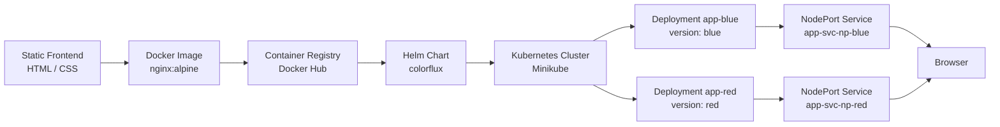

# ColorFlux - DevOps Deployment System

ColorFlux is a demonstration project that showcases a complete DevOps deployment workflow using Docker, Kubernetes, Helm, and Minikube. The application consists of two static web frontends (a blue-themed version and a red-themed version) that are containerized, packaged as a Helm chart, and deployed to a Kubernetes cluster using a blue/red deployment model.

This repository is intended as a reference implementation for:

- Containerizing static web applications with Docker
- Managing Kubernetes resources with Helm
- Running a multi-version deployment model on Minikube
- Automating build, test, and release pipelines with GitHub Actions

---

## Table of Contents

- [Architecture](#architecture)
- [Features](#features)
- [Project Structure](#project-structure)
- [Prerequisites](#prerequisites)
- [Getting Started](#getting-started)
  - [Run Locally with Docker](#run-locally-with-docker)
  - [Deploy to Kubernetes with Helm](#deploy-to-kubernetes-with-helm)
- [Helm Chart Configuration](#helm-chart-configuration)
- [CI/CD Pipelines](#cicd-pipelines)
- [Command Reference](#command-reference)
- [Troubleshooting](#troubleshooting)
- [License](#license)
- [Authors](#authors)

---

## Architecture

The system follows a standard containerized deployment pipeline. Source files are built into Docker images, published to a container registry, and deployed to a Kubernetes cluster through a Helm chart. Each application version is exposed through a dedicated NodePort service.



### Deployment Model

The project implements a blue/red deployment pattern:

| Component | Blue Version | Red Version |
|-----------|--------------|-------------|
| Source directory | `blue deployment/` | `red deployment/` |
| Docker image | `udii05/colorflux-blue` | `udii05/colorflux-red` |
| Kubernetes Deployment | `app-blue` | `app-red` |
| Pod label | `version: blue` | `version: red` |
| ClusterIP Service | `app-service-blue` | `app-service-red` |
| NodePort Service | `app-svc-np-blue` | `app-svc-np-red` |

Both versions run simultaneously in the same cluster, allowing traffic to be routed to either version independently. This pattern is commonly used for canary testing, A/B testing, and zero-downtime rollbacks.

---

## Features

- Blue and red themed static web applications
- Dockerized frontends based on the official `nginx:alpine` image
- Kubernetes Deployments, ClusterIP Services, and NodePort Services
- Helm chart for declarative, versioned application management
- Blue/red deployment model with independent version routing
- Fully functional on a local Minikube cluster
- GitHub Actions workflows for CI/CD automation

---

## Project Structure

```
devops-deployment-system/
├── .github/
│   └── workflows/
│       ├── build-test.yml        # CI: build, scan, and test on push
│       ├── deploy.yml            # CD: build and push Docker image
│       └── helm-release.yml      # Release: package and publish Helm chart
├── blue deployment/
│   ├── Dockerfile                # Nginx image for the blue version
│   ├── index-blue.html           # Blue-themed frontend
│   └── style-blue.css            # Blue theme stylesheet
├── red deployment/
│   ├── Dockerfile                # Nginx image for the red version
│   ├── index-red.html            # Red-themed frontend
│   └── style-red.css             # Red theme stylesheet
├── helm-chart/
│   ├── Chart.yaml                # Helm chart metadata
│   ├── values.yaml               # Configurable chart values
│   └── templates/
│       ├── deployment-blue.yaml  # Blue Deployment manifest
│       ├── deployment-red.yaml   # Red Deployment manifest
│       ├── service.yaml          # ClusterIP Services
│       └── service-np.yaml       # NodePort Services
├── app.py                        # Optional Python HTTP server (alternative to Nginx)
├── LICENSE.md                    # MIT License
└── README.md
```

---

## Prerequisites

Ensure the following tools are installed and available on your system:

| Tool | Purpose |
|------|---------|
| [Docker](https://www.docker.com/products/docker-desktop/) | Building and running container images |
| [Minikube](https://minikube.sigs.k8s.io/docs/start/) | Local Kubernetes cluster |
| [kubectl](https://kubernetes.io/docs/tasks/tools/) | Kubernetes command-line interface |
| [Helm](https://helm.sh/docs/intro/install/) | Kubernetes package manager |
| [Git](https://git-scm.com/) | Version control |

---

## Getting Started

### Run Locally with Docker

The application can be run directly with Docker without a Kubernetes cluster.

#### Blue Version

```bash
cd "blue deployment"
docker build -t colorflux-blue .
docker run -p 8080:80 colorflux-blue
```

Open [http://localhost:8080](http://localhost:8080) in your browser.

#### Red Version

```bash
cd "red deployment"
docker build -t colorflux-red .
docker run -p 8081:80 colorflux-red
```

Open [http://localhost:8081](http://localhost:8081) in your browser.

### Deploy to Kubernetes with Helm

#### Step 1: Start Minikube

```bash
minikube start
```

#### Step 2: Build and Push Docker Images

Build each version and push it to a container registry. Replace `udii05` with your Docker Hub username.

```bash
# Blue image
cd "blue deployment"
docker build --no-cache -t colorflux-blue .
docker tag colorflux-blue udii05/colorflux-blue:latest
docker push udii05/colorflux-blue:latest

# Red image
cd "red deployment"
docker build --no-cache -t colorflux-red .
docker tag colorflux-red udii05/colorflux-red:latest
docker push udii05/colorflux-red:latest
```

#### Step 3: Deploy with Helm

```bash
helm upgrade --install colorflux ./helm-chart
```

#### Step 4: Force Pod Recreation

If the image tags have not changed, force new pods to ensure the latest images are pulled:

```bash
kubectl delete pod -l version=blue
kubectl delete pod -l version=red
```

#### Step 5: Access the Applications

```bash
# Blue UI
minikube service app-svc-np-blue

# Red UI
minikube service app-svc-np-red
```

Both pages open automatically in your default browser.

---

## Helm Chart Configuration

The chart values are defined in `helm-chart/values.yaml`:

| Parameter | Default | Description |
|-----------|---------|-------------|
| `replicaCount` | `1` | Number of replicas per Deployment |
| `app.port` | `80` | Container port served by Nginx |
| `appBlue.image` | `udii05/colorflux-blue:v1` | Blue version container image |
| `appRed.image` | `udii05/colorflux-red:v1` | Red version container image |

To deploy a specific image version, update the values file or override on the command line:

```bash
helm upgrade --install colorflux ./helm-chart \
  --set appBlue.image=udii05/colorflux-blue:v2 \
  --set appRed.image=udii05/colorflux-red:v2
```

### Kubernetes Resources

The chart renders the following resources:

- **Deployments**: `app-blue` and `app-red`, each with `imagePullPolicy: Always`
- **ClusterIP Services**: `app-service-blue` and `app-service-red` for internal cluster access
- **NodePort Services**: `app-svc-np-blue` and `app-svc-np-red` for external access

---

## CI/CD Pipelines

The repository includes three GitHub Actions workflows:

### build-test.yml (Continuous Integration)

Triggered on pushes to the `dev-test` branch. Performs:

1. Code checkout
2. Semantic version determination from the commit message
3. SonarQube static code analysis
4. Docker image builds for both the blue and red versions
5. Trivy vulnerability scan on both images
6. Deployment of both images to test containers
7. Webpage accessibility verification for both versions
8. Cleanup of test containers and images

### deploy.yml (Continuous Deployment)

Triggered when a pull request is closed. Builds the blue and red Docker images, logs in to Docker Hub, and pushes both images with a semantic version tag and the `latest` tag.

### helm-release.yml (Helm Release)

Triggered after the deploy workflow completes. Performs:

1. Semantic version determination
2. Helm installation and chart values update (image tags for both versions)
3. Helm lint and template dry-run
4. Helm package creation
5. Helm repository index update
6. Chart push to the Helm repository

---

## Command Reference

### Docker

| Command | Description |
|---------|-------------|
| `docker build -t colorflux-blue .` | Build the blue version image |
| `docker build -t colorflux-red .` | Build the red version image |
| `docker run -p 8080:80 colorflux-blue` | Run the blue version locally |
| `docker run -p 8081:80 colorflux-red` | Run the red version locally |
| `docker tag colorflux-blue <user>/colorflux-blue:latest` | Tag an image for pushing |
| `docker push <user>/colorflux-blue:latest` | Push an image to a registry |

### Minikube and kubectl

| Command | Description |
|---------|-------------|
| `minikube start` | Start the local Kubernetes cluster |
| `minikube service app-svc-np-blue` | Open the blue NodePort service |
| `minikube service app-svc-np-red` | Open the red NodePort service |
| `kubectl get pods` | List running pods |
| `kubectl get deployments` | List deployments |
| `kubectl get services` | List services |
| `kubectl delete pod -l version=blue` | Force recreation of blue pods |
| `kubectl delete pod -l version=red` | Force recreation of red pods |

### Helm

| Command | Description |
|---------|-------------|
| `helm upgrade --install colorflux ./helm-chart` | Install or upgrade the release |
| `helm list` | List installed releases |
| `helm lint ./helm-chart` | Validate the chart |
| `helm template ./helm-chart` | Render manifests locally |
| `helm package ./helm-chart -d charts/` | Package the chart |
| `helm uninstall colorflux` | Remove the release |

---

## Troubleshooting

### Pods are not pulling the latest image

The chart uses `imagePullPolicy: Always`, but if the image tag is unchanged, Kubernetes may reuse the cached image. Force pod recreation:

```bash
kubectl delete pod -l version=blue
kubectl delete pod -l version=red
```

### Minikube cannot pull images

Ensure you are logged in to your container registry and that the image names in `helm-chart/values.yaml` match the pushed image names.

### NodePort service is not accessible

Verify the cluster is running and the services are in a healthy state:

```bash
minikube status
kubectl get svc
```

### Port already in use

If port `8080` or `8081` is occupied, change the host port mapping in the `docker run` command.

---

## License

This project is licensed under the MIT License. See [LICENSE.md](LICENSE.md) for details.

---

## Authors

- **Udita Chakraborty** - [GitHub](https://github.com/udii05) | [LinkedIn](https://www.linkedin.com/in/udita-chakraborty-b890982a2/)
- **Asmita Chakraborty** - [GitHub](https://github.com/asmitachakrab) | [LinkedIn](https://www.linkedin.com/in/asmita-chakraborty-4b19132a1/)